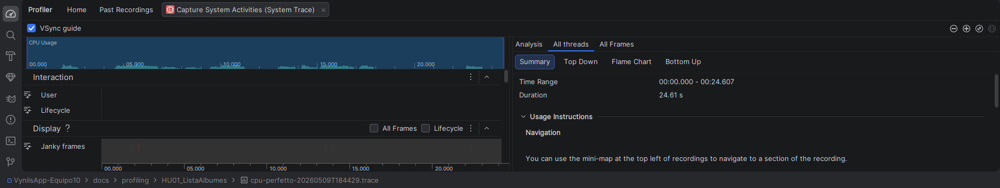

# Análisis de Perfilamiento: HU01 - Lista de Álbumes

## 1. Descripción del Flujo
Se realizó un flujo comparativo de navegación:
1. El usuario ingresa con el rol de **Coleccionista**.
2. Se carga y visualiza la **Lista de Álbumes** (Scroll realizado para verificar carga de imágenes).
3. El usuario regresa al **Home**.
4. El usuario ingresa con el rol de **Invitado**.
5. Se carga nuevamente la **Lista de Álbumes**.

## 2. Resultados del Profiler (Hallazgos Observados)

### CPU
- **Uso:** Se observan picos moderados durante la transición entre roles y el parseo del JSON de álbumes.
- **Trace:** El archivo `.trace` adjunto muestra la actividad de los hilos de renderizado.

### Memoria
- **Comportamiento:** La memoria aumenta al cargar las imágenes por primera vez (caché de Glide). Al regresar al Home y reingresar como Invitado, la memoria se mantiene estable, lo que indica una buena reutilización de recursos.

### Red (Network)
- **Peticiones:** Se observan picos de descarga al llamar al endpoint de `/albums` en ambos ingresos.

### Energía
- **Impacto:** Bajo.

## 3. Evidencia

Archivo de sesión: `cpu-perfetto-20260509T184429.trace`
