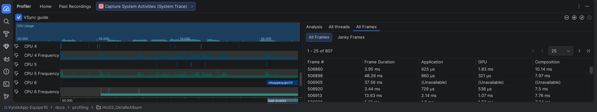

# Análisis de Perfilamiento: HU02 - Detalle de Álbum

## 1. Descripción del Flujo
El usuario realiza el siguiente flujo de navegación:
1. Desde la **Lista de Álbumes**, el usuario selecciona un álbum específico.
2. Se carga la pantalla de **Detalle del Álbum**, la cual incluye:
   - Imagen de portada (en alta resolución).
   - Información técnica (Género, Sello discográfico, Fecha de lanzamiento).
   - Lista de canciones asociadas.
   - Comentarios de otros usuarios.
3. El usuario visualiza la información y realiza scroll para ver el contenido completo.

## 2. Resultados del Profiler (Hallazgos Observados)

### CPU
- **Uso:** Pico de actividad al momento de la transición entre actividades/pantallas y durante el renderizado de la imagen de detalle.
- **Trace:** El archivo `.trace` captura la ejecución de los hilos encargados del parseo del detalle del álbum.

### Memoria
- **Comportamiento:** Incremento controlado debido a la carga de una imagen de mayor tamaño en la cabecera del detalle. El uso de memoria se mantiene estable una vez finalizada la carga, sin mostrar fugas evidentes.

### Red (Network)
- **Peticiones:** Se observa una petición GET al endpoint `/albums/{id}` para obtener la información completa del álbum y peticiones adicionales para la descarga de la imagen si no estaba en caché.

### Energía
- **Impacto:** Bajo.

## 3. Evidencia

Archivo de sesión: `cpu-perfetto-20260509T185501.trace`
